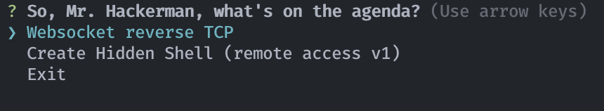

# Creating a reverse shell for macOS

::: warning
This section is VERY work-in-progress, things will change!
:::

## Prerequisites

1. Target computer has `bewm`
2. Attacking computer has [`socat`](https://github.com/andrew-d/static-binaries/tree/master/binaries)
3. Attacking computer has a  static public ip/no-ip
4. Port forwarding set up on your local network to send port 5555 to the attacking computer, ingress and egress

If you're at this stage, you've successfully bewm'd your target. Congratulations! Now, we get to mess with the spoils of our victory.


## Port and IP Setup

In this repo, I use the website `jabster28.myddns.me`, which allows me to have a static address while still having a dynamic IP. Therefore, if you wish to use this yourself, you need to replace it with your public IP (assuming you have a static one) or get a free domain at [no-ip](https://www.noip.com/).

## Local `socat`

Once you've done that, you need to open a terminal on the attacking computer and run

```bash
socat file:`tty`,raw,echo=0 tcp-listen:5555
```

which tells `socat` to expect a full TTY (a proper terminal, with tabbing and job control etc.) and listen for that on port 5555.

::: tip
If you enable adding to cron, you don't need to do this first as the victim will try to connect to the attacking computer every minute.
:::
## Running the executable

Once you've ran the executable, it should check for some dependencies, notably `screen` (comes with every macOS installation) and `socat` (like `nc`, but better; automatically installs if it isn't present). After that, you'll be greeted with some options like so:



::: warning
Right now, the only working option is the Hidden Shell. Sorry!
:::

For now we'll look at the reverse shell, whch allows us to remotely connect to the victim's computer without them having to set up port forwarding or anything like that.

## Opening the Shell

After that, you can press the "Hidden Shell" option, which will greet you with this:

```bash
? Add this to cron (persist after restart)? (y/N)
```

Adding this to the cronjob will make the computer attempt to connect to the attacker every sixty seconds, and this will persist after a restart, sort of like a long-term backdoor (or until someone runs `crontab -l`).

Once you've selected your choices, hit enter and you should be met with a shell prompt on your terminal window! If you don't like the way things look, you can `brew install fish` and use that prompt instead.